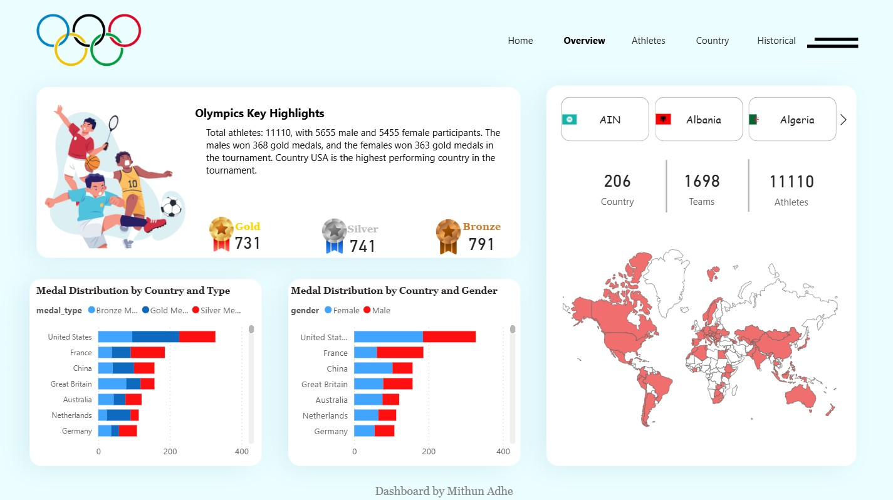
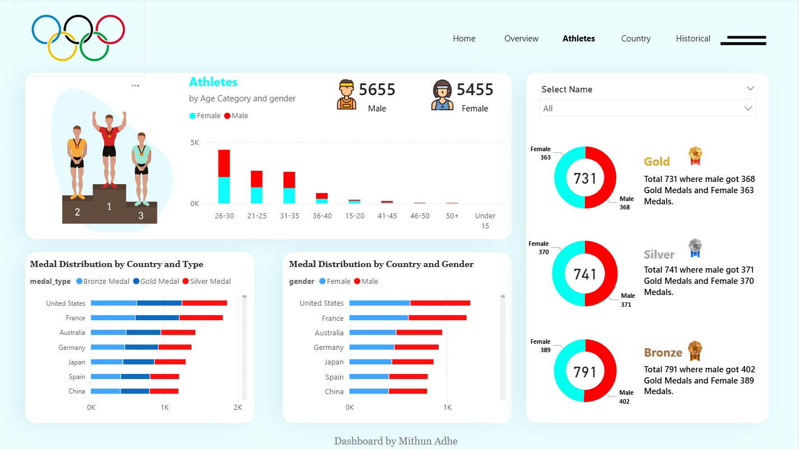
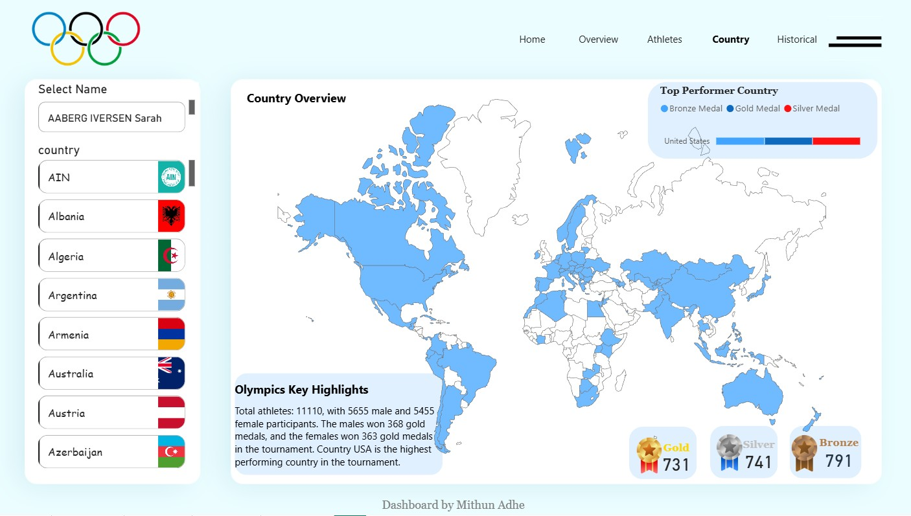
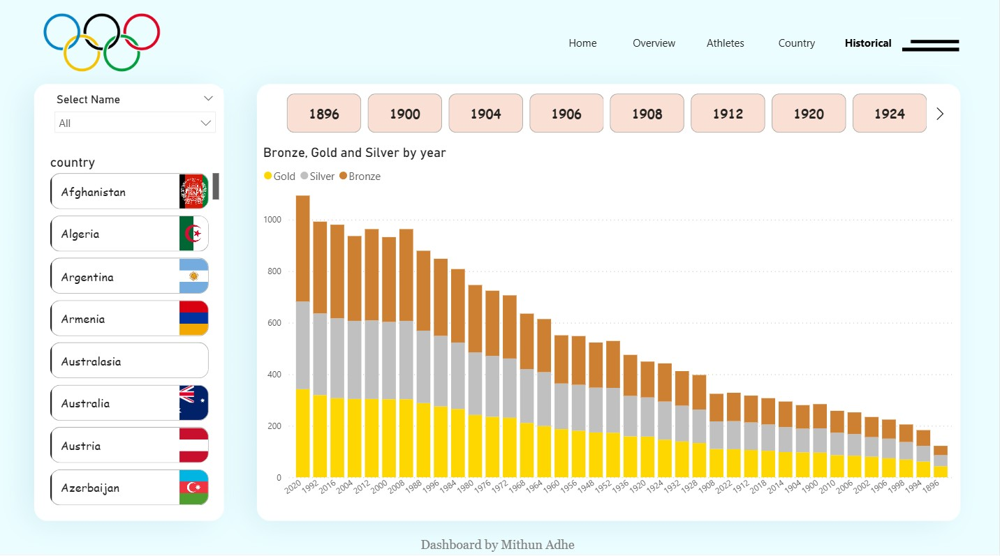

# 🏅 Paris 2024 Olympics Analytics Dashboard (Power BI)

An interactive Power BI dashboard designed to explore **Olympic athletes, medals, countries, and historical trends (1896–2024)**.

This project demonstrates **data storytelling, interactive analytics, and dashboard design** using real-world Olympic-style data.

---

# Live Dashboard

https://app.powerbi.com/view?r=eyJrIjoiY2UwZGNjZWMtZmZlNi00Yjg4LThiNjEtODMxNDU0Njc4YjNjIiwidCI6IjUzOTJmMjExLWQ5NzAtNGNkZS1hNDM2LWMxZDViZmE1Nzg3ZiJ9

---

# 📌 Project Overview

The Olympic Games generate massive datasets covering athletes, countries, teams, and medal performance across decades.

This project converts historical Olympic data into a **modern interactive analytics dashboard** that helps users:

- Understand medal performance globally 🌍
- Analyze athlete demographics 🧍‍♂️🧍‍♀️
- Compare countries across Olympic history 🏅
- Explore trends from **1896 to 2024**

The dashboard is designed to be **recruiter-ready and business-style**, showcasing Power BI and data visualization skills.

---

# ❗ Problem Statement

Sports analytics is often presented in static reports that make it difficult to:

- Compare countries and medal performance
- Analyze gender participation trends
- Understand athlete demographics
- Explore historical Olympic trends
- Identify top-performing nations

This project solves the problem using an **interactive Power BI dashboard** that enables dynamic exploration of Olympic data.

---

# 🎯 Project Objectives

The main goals of this project were to:

- Analyze Olympic medal distribution by country and gender
- Explore athlete participation by age and gender
- Visualize global Olympic performance
- Study historical medal trends (1896–2024)
- Build a multi-page interactive Power BI dashboard

---

# 📊 Dataset Information

📂 **Dataset Source:** Historical Olympic records (simulated & cleaned for analysis)

The dataset includes:

- Athlete participation records
- Country participation data
- Medal counts (Gold, Silver, Bronze)
- Olympic Games history (1896–2024)
- Age and gender demographics

---

# 🛠️ Tools & Technologies Used

| Tool | Purpose |
|------|--------|
| Power BI | Dashboard & Visualization |
| Excel / CSV | Data preprocessing |
| DAX | Measures & KPIs |
| Data Modeling | Relationships & analytics |

---

# 🔄 Project Workflow

1️⃣ Data Collection & Cleaning  
2️⃣ Data Modeling in Power BI  
3️⃣ DAX Measures Creation  
4️⃣ Dashboard UX/UI Design  
5️⃣ Insight Generation  
6️⃣ Dashboard Export & Documentation  

---

# 🧹 Data Cleaning & Preparation

Key preprocessing steps:

- Removed duplicate athlete entries
- Standardized country names and codes
- Cleaned medal classification data
- Created calculated metrics:
  - Total medals by country
  - Medal distribution by gender
  - Athlete participation trends
- Built relationships across fact and dimension tables

---

# 🔍 Exploratory Data Analysis (EDA)

The EDA phase focused on answering:

- Which countries dominate Olympic medals?
- How has participation changed over time?
- What is the gender distribution of athletes?
- Which age groups dominate the Olympics?
- How have medals evolved historically?

---

# 📈 Key Insights & Findings

### 🧍‍♂️ Athlete Participation

- Total Athletes: **11,110**
- Male Athletes: **5,655**
- Female Athletes: **5,455**

👉 Gender participation is nearly balanced in modern Olympics.

---

### 🏅 Medal Distribution

| Medal | Total | Male | Female |
|------|------|------|------|
| Gold | 731 | 368 | 363 |
| Silver | 741 | 371 | 370 |
| Bronze | 791 | 402 | 389 |

Key insight:
- Medal wins are **almost equally distributed by gender**, showing progress in gender equality.

---

### 🌍 Country Performance

- **Top Performing Country:** United States 🇺🇸
- Countries analyzed: **206**
- Teams analyzed: **1698**

---

### 🎂 Athlete Age Insights

Most athletes fall into the **21–30 age group**, indicating peak athletic performance years.

---

### 📊 Historical Olympic Trends

- Medal counts increased significantly over decades
- Participation growth accelerated after 1980
- Olympics have become increasingly global

---

# 📊 Dashboard Pages & Features

## 🏠 Overview Page
- Medal totals (Gold, Silver, Bronze)
- Country performance comparison
- Global participation metrics
- World map visualization

## 🧍 Athletes Page
- Athlete participation by age & gender
- Gender-wise medal breakdown
- Athlete filtering by name

## 🌍 Country Page
- Country-wise medal performance
- Global Olympic participation map
- Top performer analysis

## 📅 Historical Page
- Medal trends from **1896–2024**
- Year-wise Olympic performance analysis

---

# ✅ Final Outcome

A multi-page Power BI dashboard that:

✔ Explains Olympic data clearly  
✔ Demonstrates strong Power BI skills  
✔ Highlights data storytelling ability  
✔ Shows advanced dashboard design  

---

# 💼 Real-World Value

This project demonstrates skills useful for:

- Sports analytics
- Data visualization roles
- Business intelligence roles
- Data storytelling positions

---

# ▶️ How to Use

1. Download this repository
2. Open Power BI Desktop
3. Open the file:

Paris 2024.pbix

4. Click **Refresh Data**
5. Explore the dashboard interactively

---

# 🖼️ Dashboard Screenshots

### 🏠 Overview Page

### 🧍 Athletes Page

### 🌍 Country Page

### 📅 Historical Page

---

# 👨‍💻 Author

**Mithun Adhe**  
Data Analyst | Power BI Developer  

🔗 GitHub: https://github.com/MithunAdhe

---

⭐ If you like this project, consider giving it a star!
